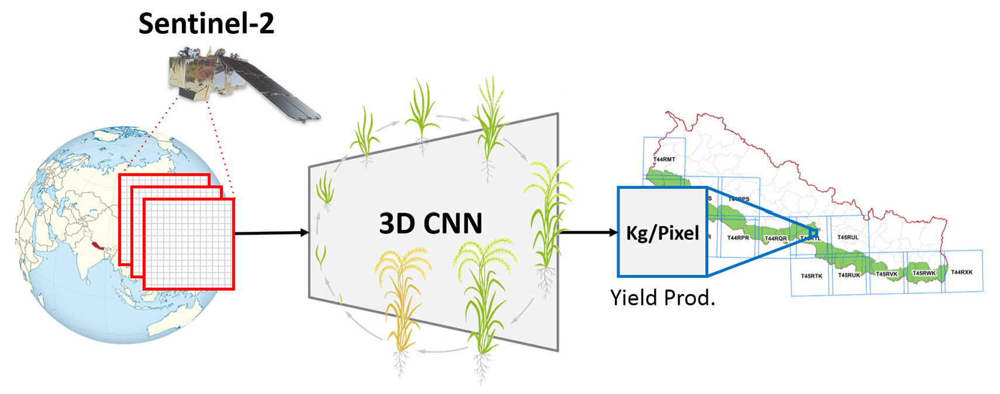

# Rice-Yield Prediction with Multi-Temporal Sentinel-2 Data and 3D CNN: A Case Study in Nepal

[Ruben Fernandez-Beltran](https://scholar.google.es/citations?user=pdzJmcQAAAAJ&hl=es),[Tina Baidar](https://scholar.google.es/citations?user=C6O3elsAAAAJ&hl=es), [Jian Kang](https://github.com/jiankang1991), [Filiberto Pla](https://scholar.google.es/citations?user=mSSPcAMAAAAJ&hl=es)
---

This repo contains the codes for the RS paper: [Rice-Yield Prediction with Multi-Temporal Sentinel-2 Data and 3D CNN: A Case Study in Nepal](https://www.mdpi.com/2072-4292/13/7/1391). Crop yield estimation is a major issue of crop monitoring which remains particularly challenging in developing countries due to the problem of timely and adequate data availability. Whereas traditional agricultural systems mainly rely on scarce ground-survey data, freely available multi-temporal and multi-spectral remote sensing images are excellent tools to support these vulnerable systems by accurately monitoring and estimating crop yields before harvest. In this context, we introduce the use of Sentinel-2 (S2) imagery, with a medium spatial, spectral and temporal resolutions, to estimate rice crop yields in Nepal as a case study. Firstly, we build a new large-scale rice crop database (RicePAL) composed by multi-temporal S2 and climate/soil data from the Terai districts of Nepal. Secondly, we propose a novel 3D Convolutional Neural Network (CNN) adapted to these intrinsic data constraints for the accurate rice crop yield estimation. Thirdly, we study the effect of considering different temporal, climate and soil data configurations in terms of the performance achieved by the proposed approach and several state-of-the-art regression and CNN-based yield estimation methods. The extensive experiments conducted in this work demonstrate the suitability of the proposed CNN-based framework for rice crop yield estimation in the developing country of Nepal using S2 data.





## Usage

`./codes/create_model_regression.m` is the proposed 3D-CNN.

`./codes/RUN_3dcnn.m` is a sample of the main script.


## Citation

```
@article{fernandez2021rice,
  title={Rice-Yield Prediction with Multi-Temporal Sentinel-2 Data and 3D CNN: A Case Study in Nepal},
  author={Fernandez-Beltran, Ruben and Baidar, Tina and Kang, Jian and Pla, Filiberto},
  journal={Remote Sensing},
  volume={13},
  number={7},
  pages={1391},
  year={2021},
  publisher={Multidisciplinary Digital Publishing Institute}
}
```

## References

[1] Russello, H. Convolutional Neural Networks for Crop Yield Prediction Using Satellite Images; IBM Center for Advanced Studies,
University of Amsterdam: Amsterdam, The Netherlands,: 2018.
